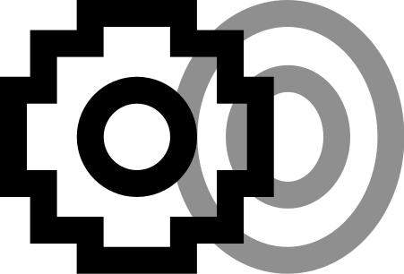

  

# Umiña Achala  
**Stones and jewelry from Peru — immutable records, authentic origins.**

[Versión en Español](README.es.md)

Tokenized gems, semi‑precious stones, minerals, and jewelry of Peru — Provenance, Compliance, and Artisan Recognition on Hedera.

In Quechua, **Umiña** means a single precious stone, while **Achala** means jewelry crafted from many stones.  
Together, *Umiña Achala* symbolizes the union of raw mineral provenance and artisan creation — recorded immutably, shared transparently, and trusted globally.

## ⚖️ Compliance
Establishing stones, minerals, and jewelry as **Real World Assets (RWAs)** ensures their provenance information is immutable and verifiable.  

Peruvian law requires that the origin of any stone or mineral be legally sourced and documented. By placing them on the blockchain, Umiña Achala ensures compliance with this requirement. Each tokenized asset establishes its uniqueness and source, giving buyers confidence in how and where it was sourced.

## 💻 Online Platform
An online marketplace displaying Umiña Achala stones and jewelry improves visibility and increases the potential for sales. Buyers can connect their digital wallets to the platform and purchase NFTs directly using supported cryptocurrencies. Each transaction is recorded on Hedera, ensuring compliance, provenance, and transparent routing of payments to artisans and treasury accounts.

## ✨ Mounted Stones & Artisan Cuts
Umiña Achala recognizes the artistry of how stones and minerals are presented. Many gems are mounted in handcrafted settings and cut in specific ways that add cultural and artistic value. NFTs capture these details by embedding mount and cut information directly into metadata.

- **Mount Type:** Silver bezel, gold prong, textile wrap, etc.  
- **Artisan Recognition:** Name or ID of the craftsman.  
- **Technique:** Filigree, inlay, carving, weaving.  
- **Stone Cut:** Brilliant, cabochon, emerald, princess, or custom artisanal cuts.  
- **Certification:** Optional fair trade or sustainability certifications.  
- **Visual Proof:** Images or 3D scans of the mounted and cut stones and minerals.  

This ensures buyers appreciate both the provenance and the artistry of each piece.

## ♻️ Lifecycle
1. **Minting**: Umiña Achala NFT minted.  
   - **NFT Minting**: A single stone, mineral, or jewelry NFT is created using Hedera Token Service (HTS).  
   - **Metadata Anchoring**: The NFT embeds provenance details (Concession ID, REINFO, Vendor RUC) tied directly to the asset.  

     - **Concession ID (INGEMMET)**: Unique identifier of the mining concession where the stone or mineral was legally extracted.  
     - **REINFO ID**: Registration number in the national registry of formalized artisanal miners.  
     - **Vendor RUC (SUNAT)**: Tax ID of the company or store selling the stone or mineral.  

   - **Consensus Notarization**: The minting event is notarized on Hedera Consensus Service (HCS).  
   - **Compliance Foundation**: This minting record forms the verifiable digital identity of the asset.  

2. **Mounting / Cutting Event**: Artisan RNA and mount type recorded, notarized on HCS.  
3. **Sales Event**: Royalties routed to artisan and treasury accounts, notarized on HCS.  
4. **Export Event**: NFT linked to VUCE COD and HS Code, compliance proof anchored on HCS.

## 🔀 Differentiation & Synergy

- **Umiña = Stone or mineral (single provenance unit, raw or mounted).**  
  Each Umiña NFT represents one legally sourced stone or mineral, immutably recorded with its concession ID, REINFO miner registration, and vendor RUC.  
  Umiña can be a raw specimen or a mounted stone — the atomic unit of provenance that captures compliance and authenticity, even when artistry is already applied.

- **Achala = Jewelry (composite artisanal product).**  
  Each Achala NFT references multiple Umiña IDs, preserving the full provenance trail of every constituent stone.  

## 🤝 Why Two Tokens?

- **Clarity of scope:** Umiña covers both raw minerals and mounted stones as single provenance units. Achala covers composite jewelry made from multiple Umiña stones.  
- **Compliance integrity:** Peruvian law distinguishes raw minerals from finished jewelry. Two tokens ensure each category meets its own regulatory requirements.  
- **Artisan recognition:** Umiña highlights miners, concessions, and even individual mounts; Achala highlights artisans who combine stones into jewelry. Together, they ensure all contributors are recognized.  
- **Market flexibility:** Buyers may want a single provenance stone (raw or mounted Umiña) or a finished jewelry piece (Achala). Two tokens allow both markets to coexist and interlink.

## 🔗 Working Together

- **Umiña feeds Achala:** Every Achala NFT references one or more Umiña NFTs, ensuring jewelry inherits the compliance and provenance of its stones — whether raw or mounted.  
- **Achala amplifies Umiña:** By embedding Umiña stones into jewelry, Achala adds cultural storytelling and artisan value, expanding the market reach.  
- **Unified ecosystem:** Together, Umiña and Achala form a dual‑token system where provenance and artistry are inseparable — immutable records for stones (raw or mounted), authentic origins for jewelry.

## 🌟 Future Vision

### Umiña Achala Coin (UMA)
UMA will evolve into the native currency of the ecosystem.  
- Used to buy and sell Umiña Achala NFTs.  
- Rewards miners and artisans for tokenizing stones and jewelry.  
- Enables fractional ownership of high‑value pieces.  
- Paired with USDC in liquidity pools to establish real cash value.  

## 📚 Documentation
- [Mining Export Documentation](rumi-documents/mining-export.md) — Workflow steps, compliance notes, and integration details.  
- [Buyer’s Checklist](rumi-documents/buyer_checklist.md) — Practical guide for buyers.  
- [Compliance](rumi-documents/compliance.md) — Export rules and regulatory references.  
- [Governance](rumi-documents/governance.md) — Oversight and boutique ownership.  
- [Legal Disclaimer](rumi-documents/legal_disclaimer.md) — Liability notes.  
- [Metadata](rumi-documents/metadata.md) — Token metadata standards.  
- [Mint NFT Token](rumi-documents/mint-nft-token.md) — Step‑by‑step minting process.  
- [Create NFT Token](rumi-documents/create-nft-token.md) — Contract creation instructions.  
- [Specimens HS Codes](rumi-documents/rumi_specimens_hs_codes.md) — Gemstone and mineral catalog.  
- [Risk Mitigation](rumi-documents/risk-mitigation.md) — Compliance and fraud prevention.  
- [Terms](rumi-documents/terms.md) — Participation terms.  
- [User Interface](rumi-documents/user_interface.md) — Marketplace and dashboard overview.  
- [Future Vision](rumi-documents/future-vision.md) — Long‑term roadmap.  
- [Reference](rumi-documents/reference.md) — Supporting materials.  

**Relevant References:**  
- Ley General de Minería (DS Nº 014-92-EM) — Peru’s General Mining Law  
- [Exportemos Portal (PROMPERÚ)](https://www.exportemos.pe) — Official portal for Peruvian exports
